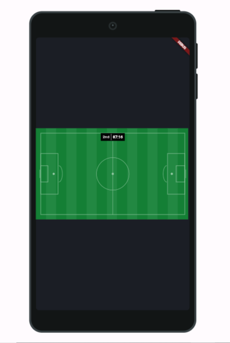
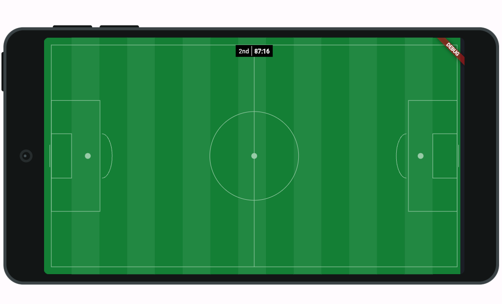

# Flutter Animations Showcase 👋


[](#)

 


A Task Management App built with Flutter Made with 💙

 
<!-- # 📲 Download

<br>
<a href="https://play.google.com/store/apps/details?id=com.ichie.todey">
    </img>
</a> -->

# Flutter Version
Flutter 3.16.5
Dart 3.2.3


# 💻 Requirements

- Any Operating System (ie. MacOS X, Linux, Windows)
- Any IDE with Flutter SDK installed (ie. IntelliJ, Android Studio, VSCode etc)
- A little knowledge of Dart and Flutter

# Football Pitch Painter Screenshots

 | 1 | 2|
|------|-------|
|||


# Command
### Install dependencies

```sh
flutter pub get
```

### Run application

```sh
flutter emulators --launch <emulator_name>
flutter run
```

### Build

```sh
flutter build apk
```

# Plugins

- [device_preview](https://pub.dev/packages/device_preview) 


# Features
- A Football Pitch Emulator Built with Custom Painter


## Author

👤 **Akintunde Damilola Sunday**

* Github: [@Dammy Richie](https://github.com/this-kin)


## Contributors
